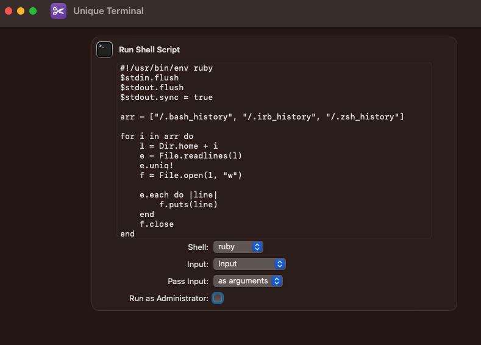

# Redundancy: A Terminal history manipulator

[](https://badge.fury.io/rb/redundancy)

Redundancy is a ruby program that loads the .zsh_history, .bash_history, .irb_history files, and applies the built in Ruby uniq! function to trim any duplicate commands present. It then writes the filtered output back to the appropriate file.

## Install

Install the gem with:

```console
gem install redundancy
```

Or add to your Gemfile:

```console
gem "redundancy"
```

## Usage

You simply need to call the gem by name. The effects of the command execution will not be seen until you restart terminal:

```console
redundancy
```

## Source Code

```ruby
#!/usr/bin/env ruby
$stdin.flush
$stdout.flush
$stdout.sync = true

arr = ["/.bash_history", "/.irb_history", "/.zsh_history"]

for i in arr do
    l = Dir.home + i
    e = File.readlines(l)
    e.uniq!
    f = File.open(l, "w")

    e.each do |line|
        f.puts(line)
    end
    f.close   
end
```

## Apple Shortcuts

The source code works better as an Apple Shortcut, as there is a significant delay running **redundancy** when Terminal is open (several closings and reopenings).

